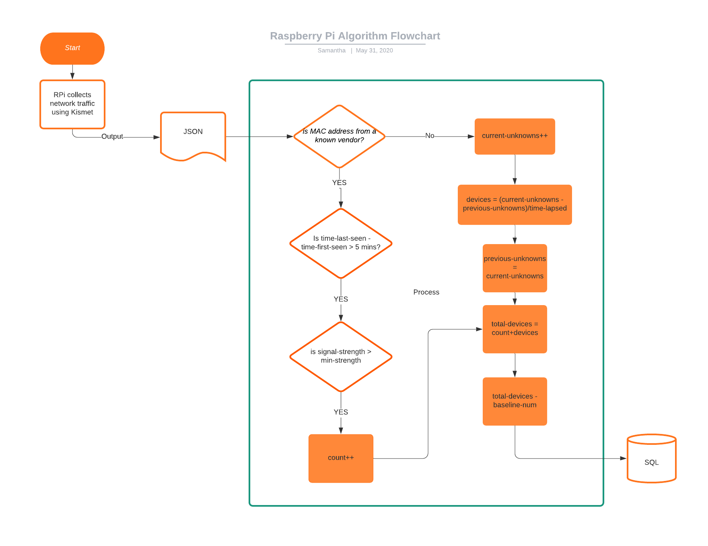

# Neat-Eats by The Bluenosers
### Challenge: Food for Thought

## The Motivation

On March 22, 2020 the province of Nova Scotia in Canada announced a state of emergency in response to the COVID-19 global pandemic. Local boutiques closed their doors, parks locked the gates, and restaurants shut down their kitchens. Additionally, borders were closed, making exporting goods all that more difficult. As a consequence, local farmers and producers have lots on of their main sources of revenue, and many industries are suffering. Fisheries is one of the main resources provided by our home province, and our largest market is Asian countries. Before COVID-19 began, 2020 was shaping up to be one of the best times in the lobster industry ever. Now, our main industry is facing its largest struggle in decades- fisherman are laid off, prices have dropped, and nobody is buying. 
  
Today it is May 30th, 2020 and three days ago our provincial government, Nova Scotia, announced that on June 5th they would be allowing restaurants to re-open their doors to dine in, patios and take out. This would mean a huge increase in revenue back to our local farmers. However, Nova Scotians are hesitant to venture out of their homes after two months of social isolation. They are concerned about businesses ability to adhere to social distancing and sanitation guidelines, and they are worried that opening up with cause a second wave of exposure. The inspiration for our project came from us trying to find a way to help Nova Scotians feel more comfortable venturing back out into the world, because our farmers and producers need us to. 

## A High Level Summary

With the closures of restaurants, local producers have experienced a severe decline in profits. We’re supporting the reopening of local food establishments in a sustainably safe way to provide local producers a revenue stream again. We’ll provide a device which relays a count of customers inside establishments to a constantly refreshing app. The app shows the current capacity of the establishment, customer reviews on social distancing and sanitization, and the location of the establishment on the SEDAC Global COVID-19 Viewer. This provides a relationship between business location, guideline adherence, and virus hotspots, allowing consumers to make decisions regarding their visit. 

## The Technology

Due to the ubiquity of wifi and bluetooth connections on both low-price and high-end consumer electronics over the past decade, wireless mid and short range networking constitutes an opportunity to uniquely count individuals in any given area. This technology was used in the mid-2010’s by retail stores as a means to uniquely identify shoppers though logging their Medium Access Control (MAC) addresses as their devices searched for wifi and bluetooth connections in stores (https://papers.mathyvanhoef.com/asiaccs2016.pdf). In response, manufacturers made it such that their devices MAC addresses became randomized. This removed the ability for individuals to uniquely track customers through simple monitoring of airwaves. However, as the research, testing, and development of the Bluenosers team showed, the ability to estimate the total number of users in a given area still exists.

Over the course of the hackathon, a working prototype of a discreet and small dual wifi/bluetooth traffic analytic device was created. By running several open-source applications and python based data-management/processing programs on a Raspberry Pi4, a packet capture device with the option for advanced filtering will allow businesses, governments, and individuals to estimate the number of individuals in an area by analyzing key metrics of packets. 

The device uses Kismet, an open source device detector and packet sniffer, the Raspberry Pi was configured to capture only the MAC addresses, signal strength, and time-stamp of unique devices. These particular metrics were chosen as they do not require the logging the actual data in the packets, due to privacy concerns. From these metrics two unique streams emerged from testing, a stream of MAC addresses having legitimate manufacturing numbers and a stream of MAC addresses with fully randomized data. The unique identifiers pertained to devices such as access points and older-devices whereas the randomized data were newer mobile devices. 

To process this data, first devices are filtered based on a minimal Wifi/bluetooth signal strength to be “inside the building”. This value is uniquely calculated given a layout of the building and the placement of the Raspberry Pi and could be calibrated or uncalibrated if needed. The MAC addresses from known vendors are then counted immediately as users and exist as users for as long as they continue to send signals within a set period. The unknown addresses are handled differently. It was discovered through testing that after an initial startup point, new random MAC addresses are detected at a range of regular intervals. By turning on and off wifi-enabled devices the rate of newly detected devices change. This can be seen in figure ____ where mock data was used to highlight the trend. Therefore, since the rate of new unknown devices correlates with the number of true active devices, an estimate of how many devices are sending these packets can be made. This number is added to the vendor MAC users and a baseline of total users representing devices such as access points and employee devices from the start of the day is subtracted. This gives an accurate estimate of the number of users in a timeframe, which is sent to the server for further processing and visualization.

Due to its ability to monitor wireless frequencies, the Pi Zero W can be easily used to cut costs to ~5USD per unit without issue. Moreover, it can be implemented in any place with minimal speed internet access and unlike other solutions, this monitoring does not require generating intrusive probe requests, creating illegitimate access points, or doing unethical deep packet analytics as seen in other research.
https://ieeexplore.ieee.org/stamp/stamp.jsp?arnumber=8747391 
https://www.researchgate.net/publication/314361145_A_Study_of_MAC_Address_Randomization_in_Mobile_Devices_and_When_it_Fails

### An Overview

## The Algorithm

## The App

